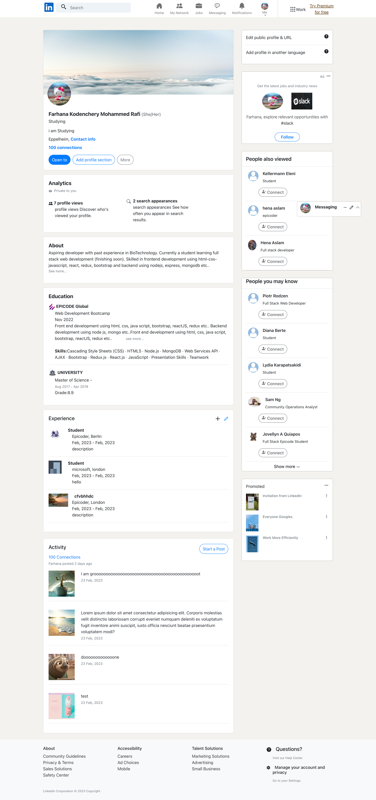

# Linkedin Clone

To run:

### `npm start`

To Build:

### `npm run build`

Technologies used :

- React.js
- Redux
- Bootstrap
- APIs
- Async Fetch

Backend Service : https://github.com/FarhanaRafi/linkedIn-BE 

Profile Page:

Feed Page

